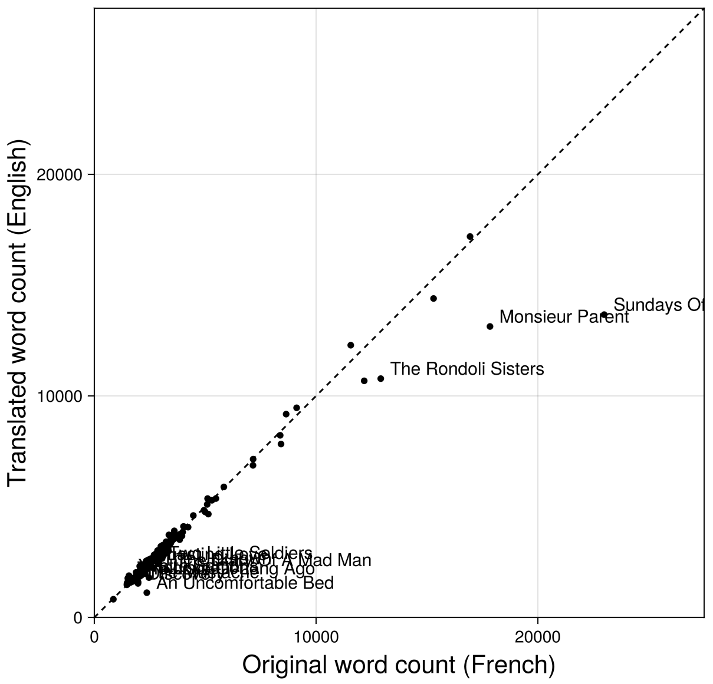
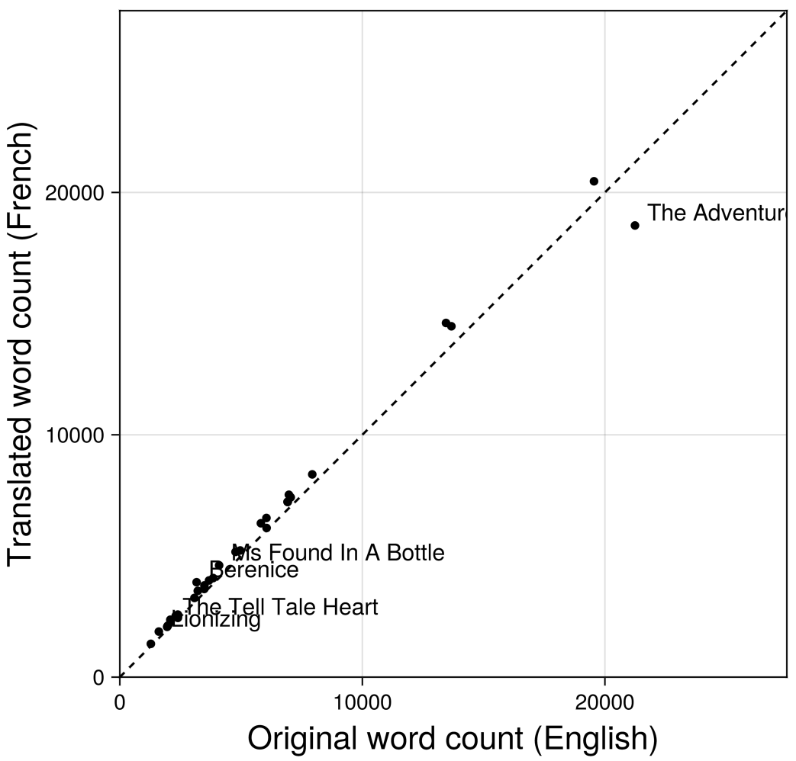

+++
title = "Introducing the Isosceles corpus: its composition and motivation"
date = 2026-02-18
description = "A quick introduction to the corpus for anyone interested in working with it, and as contextual grounding for later work."

[taxonomies]
tags = ["alignment"]
+++

# Isosceles: a corpus of 19th-century French-English pairs
This corpus is fundamental to my planned work around Maupassant's stories and the practice of literary translation. I expect it may be useful in other research applications, too, and so have released the full data on [GitHub](https://github.com/myersm0/isosceles) as well as the code for assembling the corpus and running several post-processing tasks (some of which are novel and will be written up on this site in the near future).

In this post I quickly introduce the corpus to anyone interested in working with it, and as contextual grounding for later work.

## Composition and motivation
Guy de Maupassant wrote more than 300 short stories. The most complete English translations available are those by McMaster, Henderson, Quesada, and others, hereafter referred to as McMaster et al. These translations, covering about half of Maupassant's stories, are available at [Project Gutenberg](https://www.gutenberg.org/files/3090/3090-h/3090-h.htm) and reprinted in countless e-editions. For the French originals I used the texts available at [maupassant.free.fr](http://maupassant.free.fr), digitized from the authoritative Pléiade edition (Forestier 1987).

The corpus also includes Baudelaire's French translations of Poe's tales, paired with the English originals from the 1845 Wiley & Putnam and 1850 Griswold editions. Baudelaire's Poe translations are well known and highly revered; Maupassant himself likely knew Poe's work through these same translations. They may provide an interesting contrast to the Maupassant-McMaster translations.

The third component is a pair of reference corpora from the [ELTeC](https://github.com/COST-ELTeC) project: 100 novels each in French and English, spanning 1840–1920. These provide period-appropriate baselines for native prose norms in each language.

## Matching translated texts to their originals
### Maupassant-McMaster
For the Maupassant texts, the French and English titles often don't correspond in any obvious way, so I needed to build an index mapping each English translation to its French original.

To do this, I first ran a pass of Stanza annotation and then measured proper-noun overlap between all possible French–English pairs. This worked well for most of the corpus, except for about 20 stories that I had to match manually.

To sanity-check the matches, I compared word counts between paired texts:

Outliers here, the points significantly off the diagonal, are labeled with their story names in English. The outliers typically fall on the right-hand side of the dashed line `x = y`, indicating a tendency for material to be _omitted_ in the English versions for whatever reason. "Sundays of a Bourgeois in Paris," for example, sits far to the right of the diagonal — the concluding section from the French is absent from the McMaster et al. translation. Approximately 40% of the material in that story is gone. Down in the lower left, "An Uncomfortable Bed" has an extended framing prologue in the French that the English text omits. There are perhaps other omissions in this one, too — the English translation is less than half the length of the French original.

There are also four McMaster et al. stories, not shown in this plot, that have no matching French text in the Pléiade-based corpus: "The Englishmen of Etretat," "The Lancer's Wife," "The Legion of Honor," and "The Thief." These may be misattributions.

### Poe-Baudelaire
For Baudelaire's translations of Poe there were few enough stories, with titles that easily matched up at a glance between the English and French, that I simply created the parallel index myself manually.

Below is a comparison of word counts for the Poe stories. Baudelaire's translations are much more consistent in length than we saw above with McMaster et al., and even tend to be slightly longer in the French than in the English originals. There's one notable exception, "The Adventures of One Hans Pfaal," coming in at 88% the length of the original. In fact that's the only Baudelaire translation that's shorter than the Poe original; the rest tend to be slightly longer, with a few outliers at the upper end of the range (e.g. "Lionizing," "Berenice"")

These word count plots have just been a quick way to validate that I've matched the stories correctly between the two languages, and that there were not any obvious parsing errors, or errors with the source texts themselves, that have left us with an incomplete text on one side or the other. Comparing the source texts in these outlier cases, there indeed appear to be editorial or authorial choices behind the "missing" material, rather than corpus construction errors. I may take a closer look at some of these differences in later analysis.
