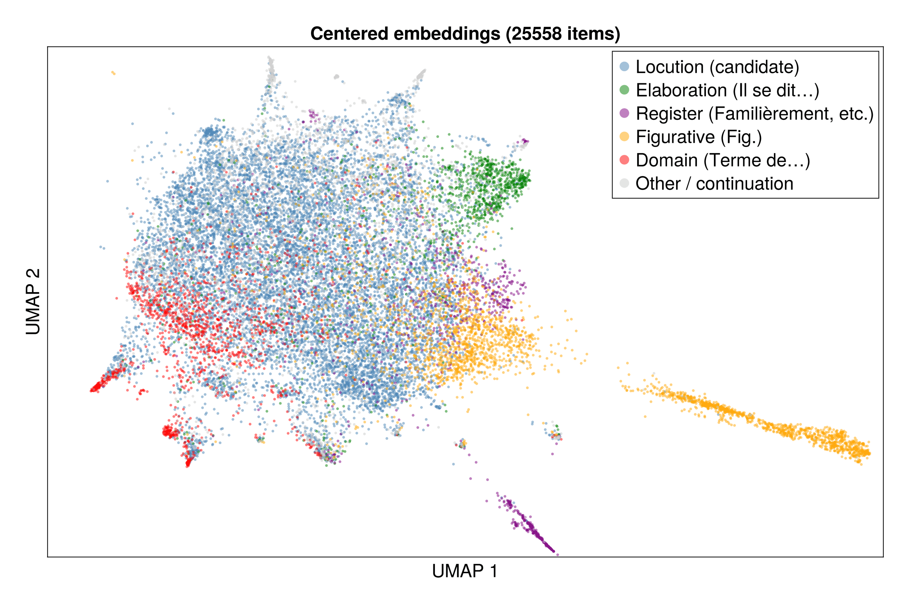

+++
title = "Introducing Deep-Littré"
date = 2026-03-10
description = "A quick introduction to the Deep-Littré: a deeply structured, computationally enriched edition of Émile Littré's French dictionary, available as TEI Lex-0 XML and SQLite."

[taxonomies]
tags = ["tools"]
+++

# Introduction
I don't have access to a hardcopy of Émile Littré's _Dictionnaire de la langue française_. Its four quarto volumes and supplement, published between 1862 and 1877, come to over 11 million words in total. That's longer than all the hundred novels of the ELTeC-Fra corpus.

Thankfully we have digital versions. François Gannaz's [XMLittré](https://www.littre.org/) project provides both a plain text and a custom XML digitization of the full dictionary. It's remarkable work. But the XML is structurally flat, whereas a typical Littré entry is a hierarchy of several kinds of information:
- **Numbered senses** — the core definitions, ordered from literal to abstract.
- **Figurative extensions** — senses marked Fig. or Figurément, where a word's meaning shifts metaphorically. Often nested under the literal sense they derive from.
- **Domain labels** — _Terme de marine_, _Terme de musique_, _Terme de botanique_ — marking definitions specific to a technical field.
- **Register labels** — _Familièrement_, _Populairement_, _Par extension_ — indicating the social or stylistic context of a usage.
- **Locutions** — fixed multi-word expressions defined under a headword. _Tomber sous la main de quelqu'un_ under headword **main**, _Aboyer à la lune_ under **aboyer**.
- **Literary citations** — dated quotations from authors spanning the 10th to the 19th century, serving as evidence for each sense.
- **Etymologies and historical notes** — tracing each word back through Provençal, Latin, Old French, with dated attestations.

In XMLittré, all of these take the form of undifferentiated "**indent**" elements, roughly 87,000 in number.

This is not a criticism of Gannaz's work. It was an enormous task. Gannaz spent "hundreds or thousands of hours" compiling his XMLittré, and I've already spent perhaps a hundred hours myself building on his work, which I've only been able to do thanks in large part to modern tools and computing power.

My derivative work that I introduce here is called [Deep-Littré](https://github.com/myersm0/deep-littre): it's an ongoing attempt to recover and represent the structure that Littré built into his entries, to make it both machine-readable and more conveniently navigable for human readers.

[Work in progress. To be continued.]

